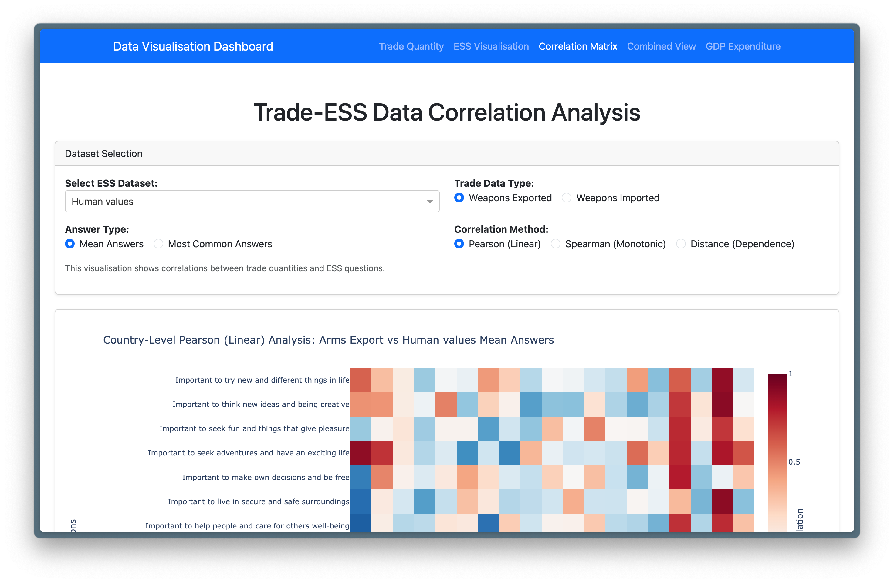

# Applied Data Science - Team Clusterf**k

## Dashboard Visualisation



### ⚡ Quickstart
This will start the Dash app on [http://127.0.0.1:8050/](http://127.0.0.1:8050/)
```
git clone https://github.com/Dhill2274/ADS_Project.git
cd ADS_Project && uv run src/unified_dashboard.py
```

or if you do not have `uv` installed:

```
git clone https://github.com/Dhill2274/ADS_Project.git
cd ADS_Project
python -m venv .venv
source .venv/bin/activate
pip install -e .
python src/unified_dashboard.py
```

Note: You may need to install [git-lfs](https://github.com/git-lfs/git-lfs).

## Figures
These are some screenshots of the Plotly figures produced by the Dashboard. To get the full interactive experience, we encourage you to use the Dashboard!

### Correlation Matrix Example 1


### Correlation Matrix Example 2


### Global Arms Exports Example


### Military Expenditure as Percentage of GDP Example


### ESS Example (Topic: Human Values, Question: Important to be rich, have money and expensive things)
